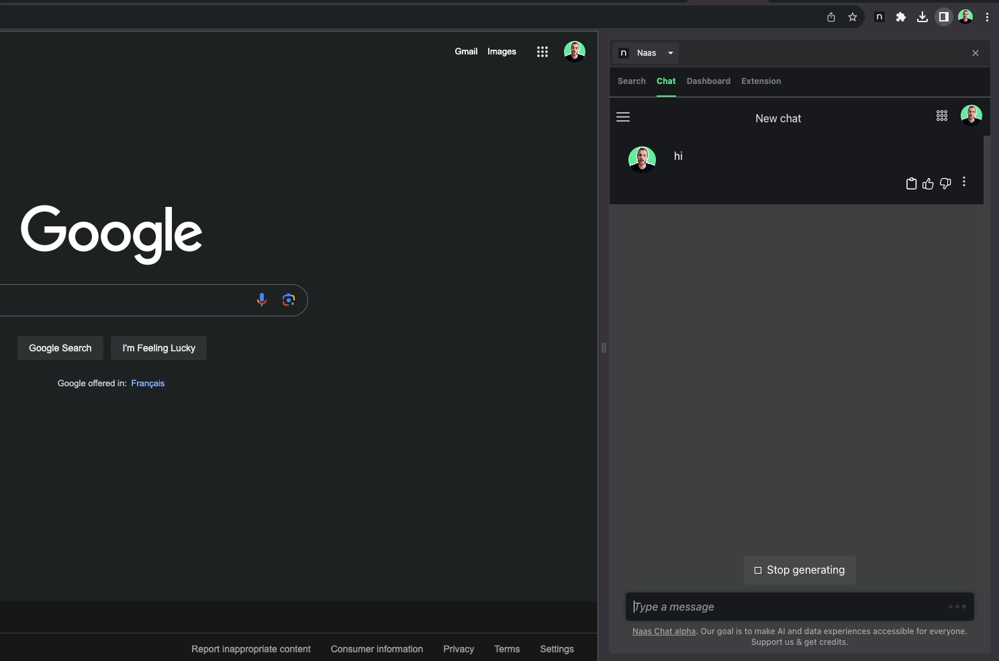

# Naas Chrome Extension

Boost your efficiency with Naas, your AI-powered assistant for effortless analytics and automation.

Discover the potential of AI, analytics, and automation through the Naas Chrome Extension. This cutting-edge tool is your ultimate digital partner, designed to amplify your productivity exponentially. Always at your fingertips on the side of your browser, it links you to a world of low-code templates and generative language models.

**Key Features:**

- **AI-Powered Search Tab**: Explore a vast array of AI and data templates, all available through a straightforward search tab. These templates act as your secret tool to accelerate your data analysis and AI tasks.
- **Easy Automation**: Transform your workflows into efficient systems. Utilize our low-code templates as plugins to automate your tasks, saving valuable time and enhancing productivity.
- **Transparent Tracking**: Maintain control with a detailed dashboard that monitors your credit usage, combining the cost of all LLMs API calls or Naas jobs you've used.

**Benefits:**

- **Always-On AI Assistant**: The Naas Chrome Extension is your round-the-clock AI ally, available to assist whenever required.
- **Enhanced Productivity**: By seamlessly integrating with numerous apps and automating workflows, the extension turns your browser into a productivity hub.
- **Optimum Resource Utilization**: With the intuitive dashboard, you can closely monitor your resource usage, ensuring you get the best value for your investment.
- **Continuous Learning**: Access to a wide range of AI and data templates facilitates ongoing learning and skill development, keeping you at the forefront of the data revolution.
- **Unmatched Integration**: The extension's capability to connect with numerous apps ensures flawless compatibility with your existing tools, making it an ideal addition to your digital toolkit.

Prepare to explore the future of productivity with the Naas Chrome Extension!

# How to Contribute?

The repository consists of two parts:

- The chrome extension code
- The notebook that retrieves the cookies and sends them to each user's server

Sample Naas token `061cbea075be42ce9ff027f22e533018`

## How to Build and Install the Extension Locally

1. Clone the repository
2. Execute `npm install`
3. Execute `npm run build`
4. Open Chrome and navigate to `chrome://extensions/`
5. Enable developer mode
6. Click on `Load unpacked extension`
7. Select the `dist` folder
8. Enjoy!

# License

This project is licensed under the GNU Affero General Public License (AGPL). 

The GNU Affero General Public License is a free, copyleft license for software and other kinds of works. It is specifically designed to ensure cooperation with the community in the case of network server software.

Under this license, you are free to use, modify, and distribute the software, but you must disclose your source code when you distribute the software to others, and network users are given the same rights as those who get the software from you directly.

This program is distributed in the hope that it will be useful, but WITHOUT ANY WARRANTY; without even the implied warranty of MERCHANTABILITY or FITNESS FOR A PARTICULAR PURPOSE. 

You should have received a copy of the GNU Affero General Public License along with this program. If not, see <https://www.gnu.org/licenses/>.

For more details, please refer to the [LICENSE](LICENSE) file in the project repository.

Please ensure you understand and comply with the license terms before using this software.